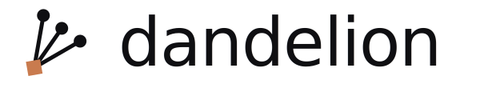
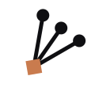
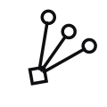

<div align="center">



**Fork a question. Weave the answers.**

A local-first desktop concept for parallel plants that merge cleanly — or surface the conflict when they don't.

[](./LICENSE)
[](https://nodejs.org/)
[](#status)
[](./tests)

</div>

---

## What it is

Take one question. Spin up parallel plants. Weave the ones you want back into the main conversation.

- If the plants add **compatible context**, the main thread continues with that context.
- If they have **different emphasis**, Dandelion folds them into one recommendation.
- If they **materially conflict**, Dandelion asks which stance should become the path forward — instead of letting the model hedge a forced synthesis.

The important product decision: **merge routing belongs to the app, not to the model's final answer prompt.**

## Status



**Pre-alpha.** The design is locked enough to test the core interaction.

Current working prototype:

- `prototype.html` is the main interactive template.
- `scripts/router-prototype-server.mjs` serves the prototype and proxies local Ollama calls.
- `qwen2.5:3b` via Ollama is the default local model.
- `scripts/merge-harness.mjs` is a CLI harness for repeatable merge-router tests.

## Repository Map

```text
README.md                         project overview and run instructions
CONTRIBUTING.md                   contribution lanes and local workflow
prototype.html                    main runnable prototype
prototype-router.html             smaller router-only comparison prototype
scripts/merge-router.mjs          canonical merge-router classifier (browser + node)
scripts/router-prototype-server.mjs
                                  local server + Ollama proxy
scripts/merge-harness.mjs         repeatable CLI merge-router harness
docs/README.md                    docs index
tests/merge-router.test.mjs       unit tests for the merge-router classifier
tests/merge-router/scenarios.json route fixtures and expected classifications
```

## Run

Requires Node.js 20+ and a running Ollama instance. No npm install is needed —
Dandelion has no dependencies. Start Ollama separately, then run:

```sh
npm start              # or: node scripts/router-prototype-server.mjs
```

Run the merge-router test suite:

```sh
npm test
```

Open:

```text
http://localhost:4321
```

The older router-only test page remains available at:

```text
http://localhost:4321/prototype-router.html
```

## Current Behavior

The prototype supports:

- Main-thread chat via local Ollama.
- Plant chat via local Ollama.
- Multiple plants generating while other plants remain editable.
- Weaving selected plants back into the main conversation.
- App-owned merge routing across three routes:

| Route | When it fires | What Dandelion does |
|---|---|---|
|  | Plants add compatible information | Continues the main thread with expanded context |
|  | Plants differ in emphasis | Folds them into one integrated recommendation |
|  | Plants propose incompatible next steps | Renders a choice prompt — never forces a synthesis |

- Conflict-choice UI rendered by the app, not improvised by the model.

Material conflicts do not call Ollama for a forced synthesis. Dandelion renders a choice prompt and waits for the user to select the path forward.

## System Diagrams

### Product Flow

```text
Root question
     |
     v
Main thread
     |
     +--------------------+
     |                    |
     v                    v
Plant A        Plant B        ... Plant N
     |                    |                      |
     +--------------------+----------------------+
                          |
                          v
                 Weave selected plants
                          |
                          v
                    Merge router
                          |
        +-----------------+-----------------+
        |                 |                 |
        v                 v                 v
Additional context   Soft disagreement   Material conflict
        |                 |                 |
        v                 v                 v
Continue with        Continue with        Ask user which
expanded context     integrated take      stance to follow
        |                 |                 |
        +-----------------+-----------------+
                          |
                          v
                   Main thread continues
```

### Runtime Shape

```text
prototype.html
  |
  |-- Main thread prompt
  |      |
  |      v
  |   /api/chat
  |
  |-- Plant prompt
  |      |
  |      v
  |   /api/chat
  |
  |-- Weave selected plants
         |
         v
      Merge router
         |
         |-- additional_context
         |      |
         |      v
         |   /api/continue
         |
         |-- soft_disagreement
         |      |
         |      v
         |   /api/continue
         |
         |-- material_conflict
                |
                v
             Conflict choice UI

/api/chat and /api/continue
  |
  v
router-prototype-server.mjs
  |
  v
Ollama qwen2.5:3b
```

## Architecture Notes

The important product decision is that merge routing belongs to the app, not the model's final answer prompt.

The reliable flow is:

```text
selected plants
  -> classify merge route
  -> if compatible: call model with merged context
  -> if material conflict: render a user choice
```

This avoids the failure mode where a model tries to summarize, hedge, or force a synthesis when the user actually needs to choose a direction.

More detail:

- [Product](docs/product.md)
- [Architecture](docs/architecture.md)
- [Merge Router](docs/merge_router.md)
- [Data Model](docs/data_model.md)
- [Docs Index](docs/README.md)
- [Contributing](CONTRIBUTING.md)

## Test Scenarios

Run the CLI harness:

```sh
node scripts/merge-harness.mjs --scenario curated_additional_context --variant router
node scripts/merge-harness.mjs --scenario curated_soft_disagreement --variant router
node scripts/merge-harness.mjs --scenario curated_provider_scope --variant router
```

Expected behavior:

- Additional context: continue naturally.
- Soft disagreement: combine into one practical recommendation.
- Material conflict: ask the user which stance to proceed with.

## Project Direction

The intended production stack remains:

- Electron + React for the desktop shell
- SQLite for local persistence
- BYO model providers: Anthropic, OpenAI, Google, and Ollama
- Local-first, no hosted backend

The current prototype deliberately avoids Electron and persistence so the interaction can be validated first.

## Brand

The mark is a DAG — three fork sources converging to a diamond merge node, rotated 35° so it reads as a windborne seed-head rather than an upright trident. The diamond visually distinguishes the *merge primitive* from the fork sources. See [`brand/brand_kit.md`](./brand/brand_kit.md) for the full kit, palette, and lockups.

<p align="center">
  
  &nbsp;&nbsp;&nbsp;
  
  &nbsp;&nbsp;&nbsp;
  
</p>

## License

MIT. See [LICENSE](./LICENSE).

<div align="center">
<sub>Built local-first. No hosted backend, no telemetry, no account.</sub>
</div>
